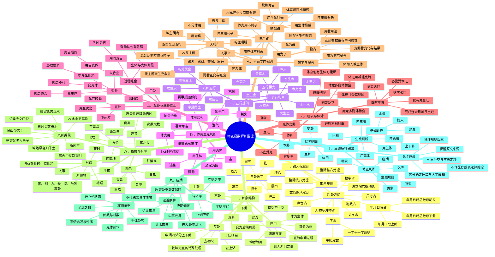

# 《梅花易数》解卦推理规则脑图


```mermaid
mindmap
  root((梅花易数解卦推理))
    一、输入与起卦
      起卦方式
        年月日時占
          年月日取上卦
          年月日時总数取下卦
          年月日時总数取动爻
        数字占
        物数占
        声音占
        字占
          一至十一字规则
          平仄取数
        丈尺占
        尺寸占
        人物与外物占
      八卦数字
        乾一
        兑二
        离三
        震四
        巽五
        坎六
        艮七
        坤八
      取余规则
        数值除八取卦
        整除按八处理
        总数除六取动爻
        整除按六处理

    二、卦象结构
      本卦
        上卦
        下卦
      动爻
        阴阳互变
        初爻至上爻
      变卦
        事情终局
      互卦
        去初爻
        去上爻
        中间四爻分上下卦
        乾坤无互的特殊处理
      体用
        动者为用
        静者为体
        体为主体
        用为所问之事
        互为中间过程
        变为后续终局

    三、五行基础
      八卦五行
        乾兑属金
        坤艮属土
        震巽属木
        坎属水
        离属火
      五行相生
        金生水
        水生木
        木生火
        火生土
        土生金
      五行相克
        金克木
        木克土
        土克水
        水克火
        火克金

    四、体用生克判断
      用生体
        进益
        得助
        吉
      体生用
        泄气
        耗失
        不利
      体克用
        主体制约事情
        通常为吉
      用克体
        事情克制主体
        通常为凶
      体用比和
        同类协调
        百事顺遂倾向

    五、互卦与变卦修正
      用卦
        即时应
      互卦
        中间应
        体互较紧
        用互次之
      变卦
        末后应
        变生体
          终局趋吉
        变与体比和
          终局协调
        变克体
          终局不利
      过程组合
        用吉变凶
          先吉后凶
        用凶变吉
          先凶后吉
        生体与克体并见
          有助益也有阻碍

    六、旺衰与体势
      四时旺衰
        春震巽木旺
        夏离火旺
        秋乾兑金旺
        冬坎水旺
        辰戌丑未月坤艮土旺
      体卦
        宜旺
        宜受生
        不宜受克
      克体之卦
        宜衰
        旺则不利加重
      同类卦党
        体党多则体势盛
        用党多则体势衰
      旺衰结论
        体旺可减轻克制
        体衰且受克则凶
        体衰但有生体可缓解

    七、主题专门规则
      天时占
        不分体用
        综合全卦五行
        离多主晴
        坎多主雨
        坤主阴晦
        乾主晴明
      人事占
        体为主
        用为宾
        再看互变与旺衰
      家宅与屋舍
        体为人或主体
        用为家宅屋舍
      婚姻占
        用生体易成
        体生用有失
        体克用可成但迟
        用克体不可成或有害
        比和为吉
      生产占
        体为母
        用为子
        体克用不利子
        用克体不利母
        用生体利母
        体生用利子
      求名、求财、交易、出行
        按主题取生克象意
        结合卦象方位与时序
      物占
        体看物质与形态
        用看用途
        互卦看数量与中间属性
        变卦看变化与结果

    八、象意与外应
      八卦类象
        乾天父老人马金
        坤地母老妇牛土
        震雷长男足木
        巽风长女股木
        坎水中男耳险
        离火中女目文明
        艮山少男手止
        兑泽少女口悦
      形物
        圆、刚、方、长、柔、破等取卦
      颜色
        青震
        红紫离
        黄坤
        白兑
        黑坎
      声音
        次数取数
        声音性质辅助吉凶
      方位
        南离
        北坎
        东震巽
        西乾兑
        东北艮
        西南坤
      外应
        人事
        地理
        天时
        所见物
        所闻声
        与体卦比较生克比和

    九、应期
      取期依据
        全卦之数
        生体卦气
        克体卦气
        卦数与时数
        行立坐状态
        事情远近与性质
      远近换算
        远事取年
        中事取月
        近事取日
      行立坐
        行则应速
        坐则应迟
        立则居中
      应期修正
        先天卦重卦气
        后天卦重卦数加时
        不可脱离具体情境

    十、最终解释输出
      基础计算
        输入
        余数
        上下卦
        动爻
      结构判断
        本卦
        变卦
        互卦
        体用
      生克判断
        用生体
        体生用
        体克用
        用克体
        比和
      修正判断
        互变
        旺衰
        主题规则
        类象
        外应
        应期
      复核要求
        保留原文来源
        标注规则版本
        区分确定计算与人工解释
        列出冲突与不确定项
        不作医疗投资法律结论
```

## 规则优先级

```text
输入与起卦
  → 本卦、动爻、变卦、互卦
  → 体用判定
  → 五行生克
  → 互变与旺衰修正
  → 占问主题规则
  → 象意、外应、应期
  → 保留原文依据和不确定项
```

原文明确要求“不可拘执于一”，因此脑图中的“通常为吉/凶”属于基础倾向，主题规则、旺衰、互变和外应可以修正它。
